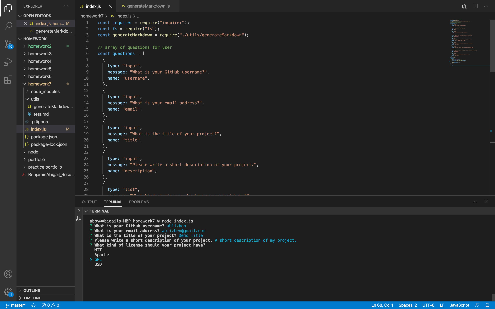
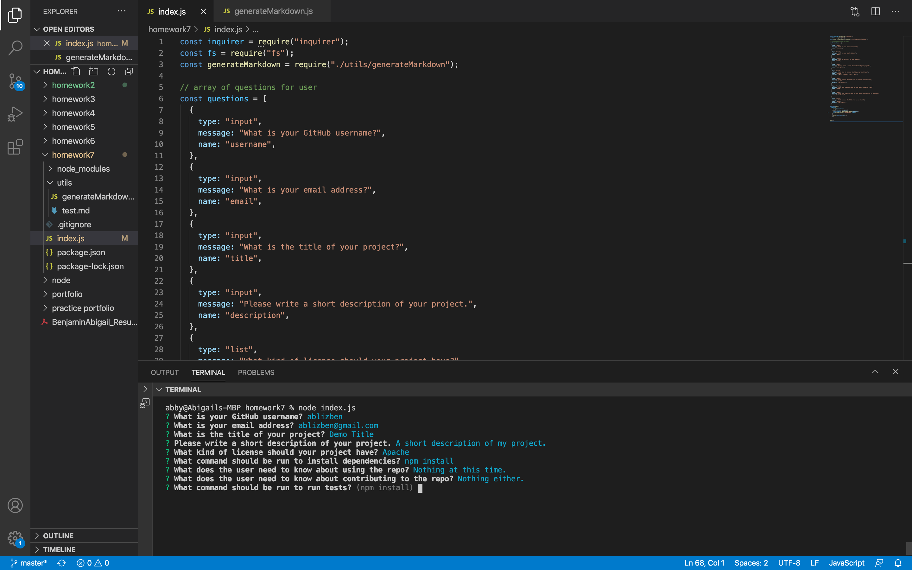
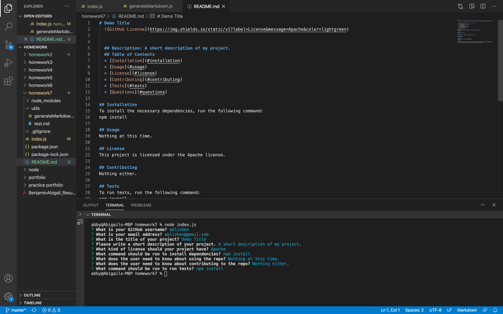

<h2>Unit 09 Node.js and ES6+ Homework: Good README Generator</h2>
The purpose of this homework was to create a README generator using the command-line application for a quick and easy generation to get started quickly.

<h3>Code Style</h3>
<ul>
  <li>JavaScript</li>
</ul>

<h3>Prerequisites</h3>
<ul>
  <li>Visual Studio Code</li>
  <li>GitHub Account</li>
  <li>NPM Inquirer Package</li>
</ul>

<h3>README Generator Criteria</h3>
<ul>
  <li>When the user is prompted for information about their application repository, then a quality, professional read me is generated the following</li>
    <ul>
     <li>Title</li>
     <li>Description</li>
     <li>Table of Contents</li>
     <li>Installation</li>
     <li>Usage</li>
     <li>License</li>
     <li>Contributing</li>
     <li>Tests</li>
     <li>Questions</li>
     </ul>
  <li>When the user enters their project title, it is displayed as the title of the README</li>
  <li>When the user enters a description, installation instructions, usage information, contribution guidelines, and test instructions, it will be added to their corresponding sections in the README</li>
  <li>When the user chooses a license for the application, then a badge is added near the top of the README and a notice is added to the section entitle License</li>
  <li>When the user enters their GitHub username, it is added to the section of the README entitled Questions, with a link to their GitHub profile</li>
  <li>When the user enters their email address, it is added to the section of the README entitled Questions, with instructions on how to reach them with additional questions</li>
  <li>When the user clicks on the links in the Table of Contents, they are taken to the corresponding section of the README</li>
</ul>

<h3><a href="https://drive.google.com/file/d/12H31MAbmbWa0DMp5IaN8mUCSfNsriUo5/view">Link to Demo</a></h3>

